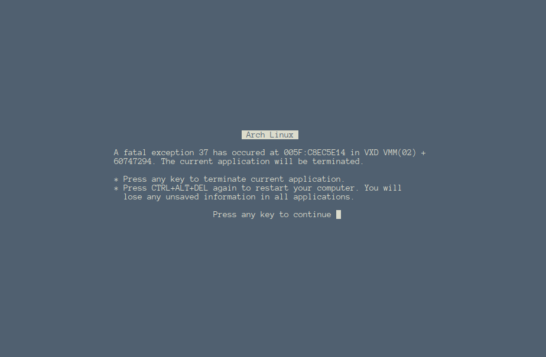

# Blue Screen of Death

Dependencies:
-----------------

* ncurses shared library

How to compile:
-----------------

```
$ cd fake-bsod
$ make
```

How to use:
-----------------

```
$ ./fake-bsod "Arch Linux"
```

Sample screenshot:
-----------------



